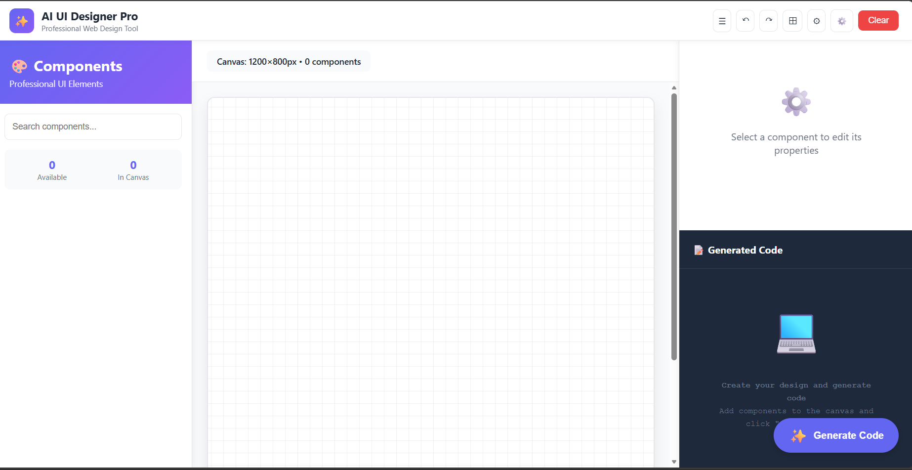

# ✨ AI UI Designer Pro — Web Edition

> **A Professional Web Design Tool Powered by AI**
> Build pixel-perfect UIs visually and export production-ready HTML/CSS using Google Gemini.

[](https://github.com/yourusername/ai-ui-designer-pro)
[](./LICENSE)
[]()
[]()

---

## 🚀 Quick Project Snapshot

**AI UI Designer Pro** is a modern, web-first UI design tool that couples an intuitive drag-and-drop canvas with AI-powered HTML/CSS generation (via Google Gemini). It is built for designers and developers who want fast, clean, and responsive front-end code straight from visual design.

- ✅ 35+ prebuilt UI components
- ✅ Responsive design templates (mobile/tablet/desktop)
- ✅ Gemini AI code generation (semantic HTML + modern CSS)
- ✅ Local-first (designs saved to browser localStorage)

---

## 📚 Table of Contents

1. [Demo & Screenshots](#-demo--screenshots)
2. [Features](#-features)
3. [Installation](#-installation)
4. [Usage](#-usage)
5. [Component Library (Overview)](#-component-library-overview)
6. [AI Code Generation](#-ai-code-generation)
7. [Security & Best Practices](#-security--best-practices)
8. [Troubleshooting](#-troubleshooting)
9. [Roadmap](#-roadmap)
10. [Contributing](#-contributing)
11. [License](#-license)

---

## 🖼️ Demo & Screenshots

> Add your demo GIFs or screenshots in the `assets/` folder and link them here. Use high-resolution images and a short GIF showing the drag-and-drop + code generation flow.

```md

```

---

## ✨ Features (At-a-glance)

**Visual Canvas**

- Drag-and-drop components with pixel snapping
- Grid overlay & rulers for alignment
- Multi-select, group, align, distribute

**Editing & Layout**

- Absolute positioning with transform handles
- Resize (constrained/unconstrained) & rotation
- Layer panel with lock, hide, reorder
- 50-step undo/redo history

**Styling**

- Color picker with presets & gradients
- Full typography controls (font family, size, weight, spacing)
- Borders, radii, shadows, filters, blend modes
- Animation presets (fade, slide, bounce, pulse)

**Responsive**

- Device templates (iPhone / Android / Tablet / Desktop)
- Toggle between breakpoints to edit styles per device
- Collapsible sidebars for smaller viewports

**AI Code Generation**

- Generates semantic HTML5 + modern CSS with responsive rules
- Accessibility-minded output (ARIA attributes, focus states)
- Live code preview + one-click copy

**Developer-friendly**

- Exports that are ready to paste into projects
- Minimal dependencies: vanilla JS + Bootstrap utilities
- LocalStorage for project autosave

---

## 🛠️ Installation

1. Clone the repo

```bash
git clone https://github.com/yourusername/ai-ui-designer-pro.git
cd ai-ui-designer-pro
```

2. Run a local server (recommended)

```bash
python -m http.server 8000
# Open http://localhost:8000
```

3. Optional: Add demo assets

- Put screenshots/gifs in `assets/` and reference them in this README

---

## 🧭 Usage

1. Open the app in your browser.
2. Open **Settings (⚙️)** and paste your **Gemini API key**.
3. Drag components from the left sidebar onto the canvas.
4. Edit properties in the right-hand panel (position, style, spacing).
5. Click **Generate Code** (FAB) to produce HTML/CSS. Review code in the code preview panel.

**Keyboard shortcuts**

- `Ctrl/Cmd + Z` — Undo
- `Ctrl/Cmd + Y` — Redo
- `Ctrl/Cmd + D` — Duplicate
- `Ctrl/Cmd + L` — Toggle Lock
- `Delete` — Remove

---

## 🧩 Component Library (Overview)

**Text:** H1, H2, H3, Paragraph, Link

**Forms:** Text Input, Textarea, Select, Checkbox, Radio

**Interactive:** Button, Badge, Alert, Tooltip

**Layout:** Container, Card, Modal, Sidebar, Navbar, Footer

**Advanced:** Carousel, Gallery, Tabs, Accordion, Timeline, Progress Bar, Avatar, Video

---

## 🤖 AI Code Generation — How it Works

1. Selected canvas state is serialized into a compact design model.
2. The model is sent to Google Gemini (configured model: `gemini-2.0-flash` by default).
3. Gemini returns human-readable HTML + CSS. The UI surfaces the output in a preview panel and provides copy/export actions.

**Notes & tips**

- Keep components visible and well-named for better code quality.
- Use simple layouts for predictable generation results.
- For production, proxy requests through a backend to keep API keys secret.

---

## 🔐 Security & Best Practices

- **Never** commit your Gemini API key to source control.
- Use a backend proxy in production to sign/forward requests.
- Restrict API keys via Google Cloud console to your domain/IPs.

---

## 🐛 Troubleshooting

**401 Unauthorized** — check the Gemini API key and model name.

**429 Too Many Requests** — rate limits triggered: wait or rotate keys.

**Blank Preview** — inspect browser console for errors; ensure network calls succeed.

**Slow canvas** — reduce the number of live effects/animations or close panels.

---

## 🛣️ Roadmap

Planned features prioritized for the next releases:

- [ ] Figma import/export
- [ ] Collaborative real-time editing
- [ ] React/Vue component export
- [ ] Dark mode & custom themes
- [ ] Component presets & templates
- [ ] Animation timeline editor
- [ ] Design tokens & style system export

---

## 🤝 Contributing

Contributions are welcome. Please follow these steps:

1. Fork this repository
2. Create a branch: `git checkout -b feature/awesome`
3. Commit your changes: `git commit -m "Add awesome feature"`
4. Push: `git push origin feature/awesome`
5. Open a Pull Request

Please include a detailed description and screenshots for UI changes.

---

## 📝 License

This project is licensed under the **MIT License**. See [LICENSE](./LICENSE) for details.

---

## 🙏 Credits

Made with ❤️ by the **AI UI Designer Pro Team**

---

_Last updated: 2025-11-10_
